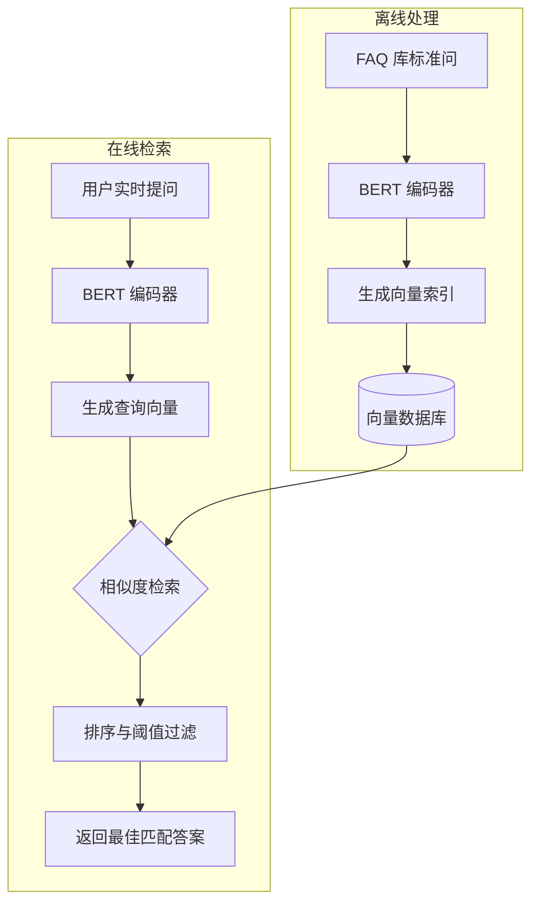

# 作业 2：基于 BERT 的文本编码与相似度计算技术方案

## 1. 技术方案描述

本方案采用 **BERT (Bidirectional Encoder Representations from Transformers)** 作为核心编码器，通过计算余弦相似度实现问题匹配。

### 1.1 文本编码阶段
*   **预处理**：对输入文本进行清洗，去除特殊字符。
*   **Tokenization**：使用 BERT 分词器将文本转化为 Input IDs、Attention Mask 等。
*   **特征提取**：将数据输入预训练的 BERT 模型。取模型最后一层的 `[CLS]` 向量或对所有 Token 向量取平均（Mean Pooling），得到一个 768 维（base 版本）的语义向量。

### 1.2 相似度计算阶段
*   **离线索引**：预先将 FAQ 库中的所有“标准提问”和“相似提问”通过上述过程转化为向量，存入向量数据库。
*   **在线匹配**：将用户的实时提问转化为向量，利用**余弦相似度（Cosine Similarity）**公式计算该向量与库中所有向量的距离。
*   **结果返回**：选取相似度得分最高且超过阈值（如 0.85）的提问，返回其对应的答案。

## 2. 技术流程图 (Mermaid)

